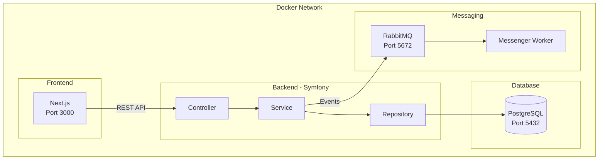

# Conference Room Booking System

[](https://www.php.net/)
[](https://symfony.com/)
[](https://nextjs.org/)
[](https://www.postgresql.org/)
[](https://docs.docker.com/compose/)
[](https://opensource.org/licenses/MIT)

> System zarządzania rezerwacjami sal konferencyjnych z walidacją konfliktów czasowych i powiadomieniami przez RabbitMQ.

---

## Spis treści

- [Funkcjonalności](#funkcjonalności)
- [Stack technologiczny](#stack-technologiczny)
- [Wymagania](#wymagania)
- [Szybki start](#szybki-start)
- [Dostępne URL-e](#dostępne-url-e)
- [Komendy](#komendy)
- [Architektura](#architektura)
- [API](#api)
- [Testowanie](#testowanie)
- [Autor](#autor)

---

## Funkcjonalności

### Backend (REST API)
- ✅ CRUD dla sal konferencyjnych
- ✅ CRUD dla rezerwacji
- ✅ Walidacja konfliktów czasowych (brak nakładających się rezerwacji)
- ✅ Asynchroniczne powiadomienia przez RabbitMQ
- ✅ Repository Pattern z interfejsami

### Frontend (Panel administracyjny)
- ✅ Lista sal konferencyjnych
- ✅ Formularze dodawania i edycji sal
- ✅ Interaktywny kalendarz rezerwacji (FullCalendar)
- ✅ Responsywny interfejs (Tailwind CSS)

---

## Stack technologiczny

| Warstwa | Technologie |
|---------|-------------|
| **Backend** | PHP 8.3, Symfony 7.0, Doctrine ORM |
| **Frontend** | Next.js 14, React 18, TypeScript, Tailwind CSS |
| **Baza danych** | PostgreSQL 16 |
| **Messaging** | RabbitMQ 3.13 |
| **DevOps** | Docker, Docker Compose, Nginx |

---

## Wymagania

- [Docker](https://docs.docker.com/get-docker/) >= 24.0
- [Docker Compose](https://docs.docker.com/compose/install/) >= 2.20
- [Git](https://git-scm.com/) >= 2.40
- [Make](https://www.gnu.org/software/make/) (opcjonalnie, dla wygodnych komend)

---

## Szybki start

### 1. Klonowanie repozytorium

```bash
git clone https://github.com/piotradamczyk8/conference-room-booking.git
cd conference-room-booking
```

### 2. Konfiguracja środowiska

```bash
cp .env.example .env
```

### 3. Uruchomienie aplikacji

```bash
# Budowanie i uruchomienie wszystkich serwisów
make install

# Lub bezpośrednio przez Docker Compose
docker compose up -d --build
```

### 4. Migracje bazy danych

```bash
make migrate
```

### 5. Gotowe!

Otwórz przeglądarkę i przejdź do http://localhost:3000

---

## Dostępne URL-e

| Usługa | URL | Opis |
|--------|-----|------|
| **Frontend** | http://localhost:3000 | Panel administracyjny |
| **Backend API** | http://localhost:8080/api | REST API |
| **RabbitMQ UI** | http://localhost:15672 | Management UI (guest/guest) |
| **API Docs** | http://localhost:8080/api/doc | Dokumentacja OpenAPI |

---

## Komendy

Projekt wykorzystuje Makefile dla wygodnych aliasów:

```bash
# Instalacja i uruchomienie
make install          # Pełna instalacja (build + migrate)
make start            # Uruchomienie środowiska
make stop             # Zatrzymanie środowiska
make restart          # Restart

# Logowanie i debugging
make logs             # Podgląd wszystkich logów
make logs-backend     # Logi backend
make logs-frontend    # Logi frontend

# Baza danych
make migrate          # Wykonanie migracji
make db-reset         # Reset bazy danych

# Testy
make test             # Wszystkie testy
make test-backend     # Testy PHP (PHPUnit)
make test-frontend    # Testy JS (Jest)

# Jakość kodu
make lint             # Linter (PHPStan + ESLint)
make fix              # Automatyczna naprawa stylu

# Shell
make shell-backend    # Shell do kontenera backend
make shell-frontend   # Shell do kontenera frontend
```

---

## Architektura



### Wzorce projektowe

| Wzorzec | Zastosowanie |
|---------|--------------|
| **Repository Pattern** | Abstrakcja dostępu do bazy danych |
| **Service Layer** | Enkapsulacja logiki biznesowej |
| **DTO** | Transfer danych między warstwami |
| **Dependency Injection** | Luźne powiązania, testowalność |
| **Event-Driven** | Asynchroniczne powiadomienia (RabbitMQ) |

---

## API

### Endpointy

| Method | Endpoint | Opis |
|--------|----------|------|
| `GET` | `/api/rooms` | Lista sal |
| `GET` | `/api/rooms/{id}` | Szczegóły sali |
| `POST` | `/api/rooms` | Nowa sala |
| `PUT` | `/api/rooms/{id}` | Aktualizacja sali |
| `DELETE` | `/api/rooms/{id}` | Usunięcie sali |
| `GET` | `/api/reservations` | Lista rezerwacji |
| `GET` | `/api/reservations/{id}` | Szczegóły rezerwacji |
| `POST` | `/api/reservations` | Nowa rezerwacja |
| `PUT` | `/api/reservations/{id}` | Aktualizacja rezerwacji |
| `DELETE` | `/api/reservations/{id}` | Usunięcie rezerwacji |

### Przykład - tworzenie rezerwacji

```bash
curl -X POST http://localhost:8080/api/reservations \
  -H "Content-Type: application/json" \
  -d '{
    "roomId": "uuid-sali",
    "reservedBy": "Jan Kowalski",
    "title": "Spotkanie projektowe",
    "startTime": "2026-01-15T10:00:00+00:00",
    "endTime": "2026-01-15T11:00:00+00:00"
  }'
```

---

## Testowanie

### Backend (PHPUnit)

```bash
make test-backend

# Lub bezpośrednio
docker compose exec backend php bin/phpunit
```

### Frontend (Jest)

```bash
make test-frontend

# Lub bezpośrednio
cd frontend && npm test
```

---

## Struktura projektu

```
conference-room-booking/
├── backend/                    # Symfony 7.0
│   ├── src/
│   │   ├── Controller/Api/     # REST Controllers
│   │   ├── Entity/             # Doctrine Entities
│   │   ├── Repository/         # Repository Pattern
│   │   ├── Service/            # Business Logic
│   │   ├── DTO/                # Data Transfer Objects
│   │   ├── Message/            # RabbitMQ Messages
│   │   └── MessageHandler/     # Message Handlers
│   └── tests/
│
├── frontend/                   # Next.js 14
│   ├── src/
│   │   ├── app/                # App Router
│   │   ├── components/         # React Components
│   │   ├── hooks/              # Custom Hooks
│   │   └── lib/                # Utilities
│   └── tests/
│
├── docker/                     # Docker configs
│   ├── nginx/
│   ├── php/
│   └── rabbitmq/
│
├── docs/                       # Documentation
├── docker-compose.yml
├── Makefile
└── README.md
```

---

## Autor

**Piotr Adamczyk**

- GitHub: [@piotradamczyk8](https://github.com/piotradamczyk8)

---

## Licencja

Ten projekt jest licencjonowany na warunkach licencji MIT - szczegóły w pliku [LICENSE](LICENSE).
