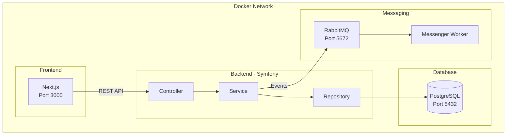

# Architektura systemu

> Conference Room Booking System - dokumentacja architektury

---

## Przegląd

System zarządzania rezerwacjami sal konferencyjnych zbudowany w architekturze mikroserwisowej z wykorzystaniem konteneryzacji Docker.

---

## Diagram architektury



---

## Serwisy

| Serwis | Technologia | Port | Opis |
|--------|-------------|------|------|
| Frontend | Next.js 14 | 3000 | Panel administracyjny SPA |
| Backend | Symfony 7.0 | 9000 (FPM) | REST API |
| Nginx | Nginx Alpine | 8080 | Reverse proxy |
| Database | PostgreSQL 16 | 5432 | Baza danych |
| RabbitMQ | RabbitMQ 3.13 | 5672/15672 | Message broker |
| Messenger | Symfony | - | Asynchroniczny worker |

---

## Warstwy aplikacji (Backend)

### 1. Controller Layer

Obsługa żądań HTTP, walidacja wejścia, zwracanie odpowiedzi JSON.

```
src/Controller/Api/
├── RoomController.php
└── ReservationController.php
```

### 2. Service Layer

Logika biznesowa, orkiestracja operacji.

```
src/Service/
├── RoomService.php
├── ReservationService.php
└── ReservationConflictChecker.php
```

### 3. Repository Layer

Abstrakcja dostępu do danych, implementacja wzorca Repository.

```
src/Repository/
├── RoomRepositoryInterface.php
├── RoomRepository.php
├── ReservationRepositoryInterface.php
└── ReservationRepository.php
```

### 4. Entity Layer

Model domenowy, encje Doctrine.

```
src/Entity/
├── Room.php
└── Reservation.php
```

---

## Wzorce projektowe

| Wzorzec | Zastosowanie |
|---------|--------------|
| **Repository** | Abstrakcja dostępu do bazy danych |
| **Service Layer** | Enkapsulacja logiki biznesowej |
| **DTO** | Transfer danych między warstwami |
| **Dependency Injection** | Luźne powiązania, testowalność |
| **Event-Driven** | Asynchroniczne powiadomienia |

---

## Przepływ danych

### Tworzenie rezerwacji

```
1. [Frontend] POST /api/reservations
       │
       ▼
2. [Controller] ReservationController::create()
       │
       ▼
3. [Validation] Symfony Validator
       │
       ▼
4. [Service] ReservationService::createReservation()
       │
       ├──▶ [ConflictChecker] sprawdzenie konfliktów
       │
       ├──▶ [Repository] zapis do bazy
       │
       └──▶ [MessageBus] publikacja ReservationCreatedMessage
                │
                ▼
5. [RabbitMQ] kolejka "messages"
       │
       ▼
6. [Worker] ReservationCreatedHandler
       │
       ▼
7. [Notification] (email, Slack, etc.)
```

---

## Baza danych

### Schemat

```sql
-- Tabela sal konferencyjnych
CREATE TABLE rooms (
    id UUID PRIMARY KEY,
    name VARCHAR(100) NOT NULL,
    description TEXT,
    capacity INTEGER NOT NULL,
    floor VARCHAR(50),
    amenities JSONB DEFAULT '[]',
    is_active BOOLEAN DEFAULT TRUE,
    created_at TIMESTAMP NOT NULL,
    updated_at TIMESTAMP NOT NULL
);

-- Tabela rezerwacji
CREATE TABLE reservations (
    id UUID PRIMARY KEY,
    room_id UUID NOT NULL REFERENCES rooms(id) ON DELETE CASCADE,
    reserved_by VARCHAR(100) NOT NULL,
    title VARCHAR(255),
    start_time TIMESTAMP NOT NULL,
    end_time TIMESTAMP NOT NULL,
    notes TEXT,
    created_at TIMESTAMP NOT NULL
);

-- Indeks dla szybkiego wyszukiwania konfliktów
CREATE INDEX idx_reservation_time_range 
ON reservations(room_id, start_time, end_time);
```

---

## Bezpieczeństwo

- **CORS** - Nelmio CORS Bundle
- **Input Validation** - Symfony Validator
- **SQL Injection** - Doctrine ORM (prepared statements)
- **XSS** - React automatic escaping
- **Secrets** - Environment variables
